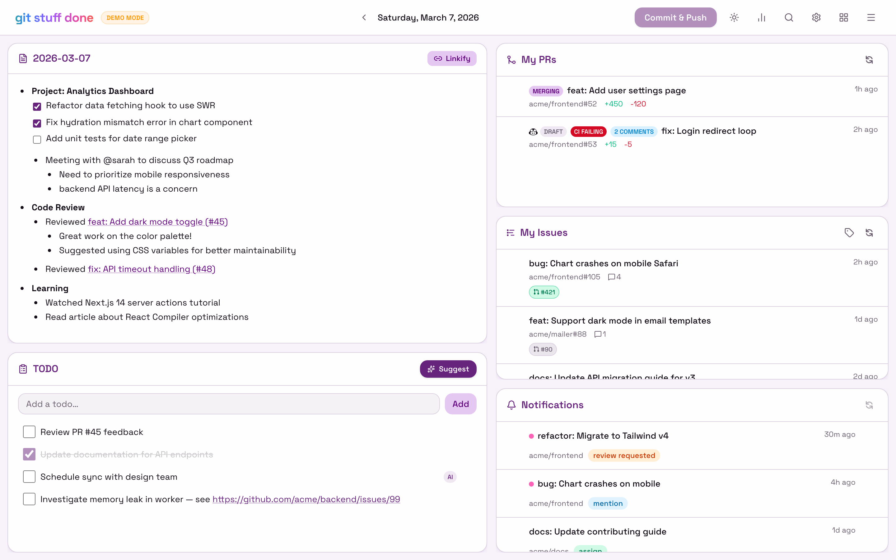
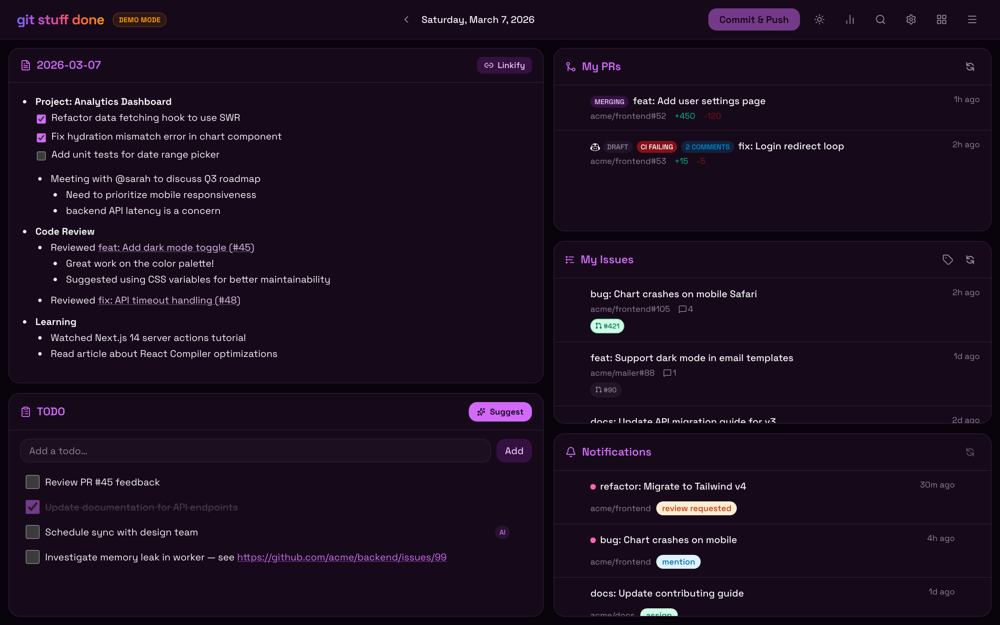

# ✨ git-stuff-done

**git-stuff-done** is your personal developer dashboard designed to keep you in the flow. It combines a distraction-free markdown editor for your daily work logs with AI superpowers. Track your work, manage your PRs and GitHub notifications, and generate work summaries all in one place.

### 👉 [check out the demo](https://therzka.github.io/git-stuff-done/) 👈

(or see [screenshots](#screenshots) below)

## Features

- **📝 Work Log Editor** — Hybrid markdown editor with inline rendering. Supports drag-and-drop images, `@mention` autocomplete for GitHub org members, and Slack thread previews.
- **✨ AI Assistant** — Summarize your work logs for standups or weekly reports.
- **🔎 Search** — Search across all logs with natural language queries from the dedicated search modal.
- **✅ TODO List** — Manual TODOs and AI-suggested action items based on your work log.
- **🔀 My PRs** — Live feed of your open PRs with status badges (Draft, CI Failing, Needs Review, merge queue, etc.).
- **🐛 My Issues** — Open issues assigned to you with linked PR status and one-click Copilot agent assignment.
- **🔔 Notifications** — Filtered GitHub notifications for reviews, mentions, and assignments.
- **🤖 Agent Sessions** — Browse recent Copilot Cloud Agent sessions with summaries and PR/commit links.
- **🚀 Auto-commit & Push** — Hourly auto-commit of your logs and TODOs to a git repository


## Prerequisites

- **Node.js** 20+
- **GitHub Copilot CLI** (`copilot`) in your PATH — [installation guide](https://docs.github.com/en/copilot/how-tos/set-up/install-copilot-cli)
- **GitHub Personal Access Token** with Issues, PRs, Notifications, Actions, and Contents scopes (write access required for Copilot agent assignment)
- **GitHub CLI** (`gh`) — optional fallback for GitHub API access
- **gh-slack extension** — optional, enables Slack thread viewing: `gh extension install https://github.com/rneatherway/gh-slack`

## Setup

1. **Fork, then clone your fork:**

   ```bash
   git clone https://github.com/<your-username>/git-stuff-done git-stuff-done
   cd git-stuff-done
   npm install
   ```

   > ⚠️ Do not clone this repo directly — auto-commit pushes to your git remote.

2. **Create a GitHub PAT** at https://github.com/settings/personal-access-tokens/new with Issues, Pull requests, Notifications, Actions, and Contents permissions. If your org requires SSO, authorize the token for your org.

3. **Configure environment:**

   ```bash
   cp .env.example .env.local
   ```

   Edit `.env.local`:
   - `GITHUB_READ_TOKEN` — the PAT from step 2
   - `GITHUB_ORG` — your GitHub org name
   - `GIT_STUFF_DONE_DATA_DIR` — (recommended) path to a separate git repo for logs/TODOs

4. **Run the dashboard:**
   ```bash
   npm run dev
   ```
   Open http://localhost:3000

## Environment Variables

| Variable                  | Default                           | Description                                                             |
| ------------------------- | --------------------------------- | ----------------------------------------------------------------------- |
| `GITHUB_ORG`              | _(none)_                          | GitHub org to filter notifications, PRs, and links                      |
| `GITHUB_READ_TOKEN`       | _(falls back to `gh auth token`)_ | GitHub PAT with Issues, PRs, Notifications, Actions, Contents scopes    |
| `GIT_STUFF_DONE_DATA_DIR` | `./` (app dir)                    | Path to a git repo where `logs/` and `data/` will be stored             |

## Screenshots

|                     Light Mode                      |                     Dark Mode                      |
| :-------------------------------------------------: | :------------------------------------------------: |
|  |  |
