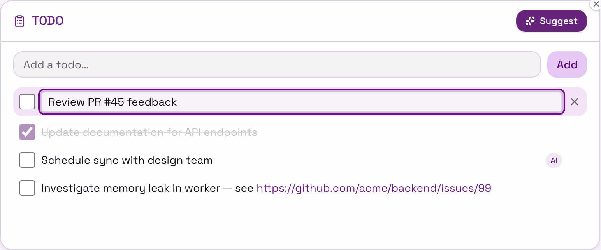
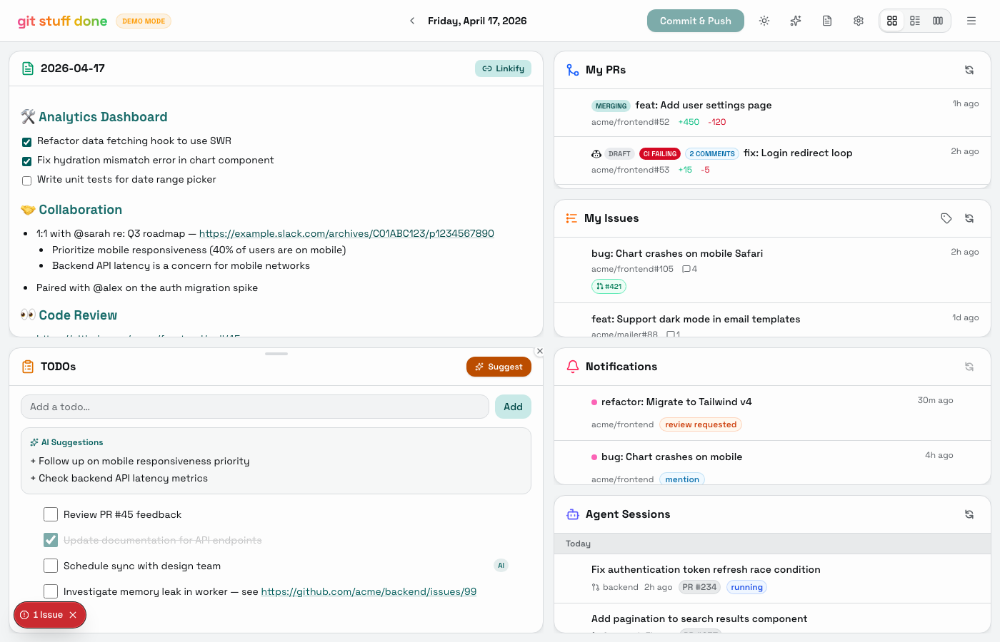
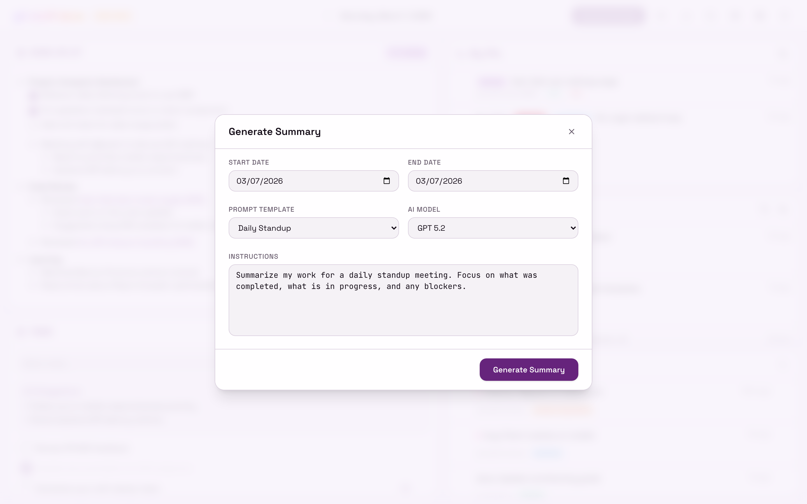
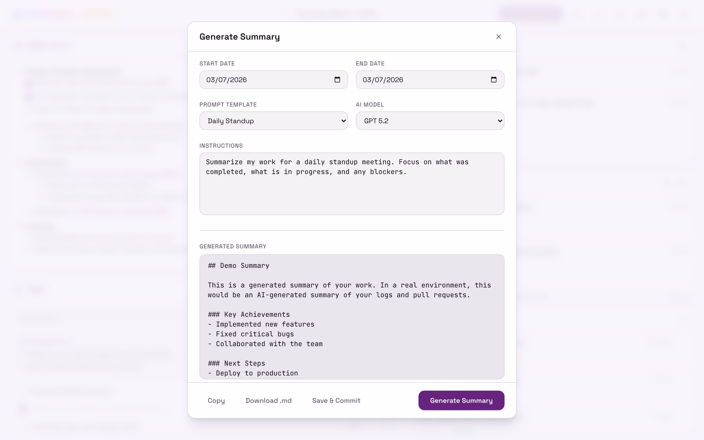
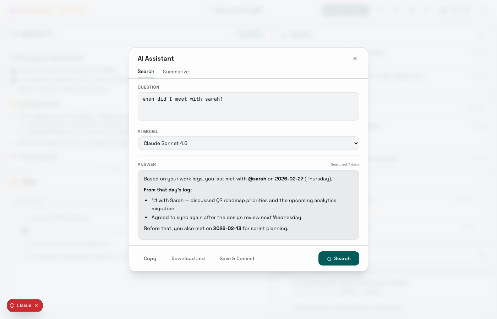
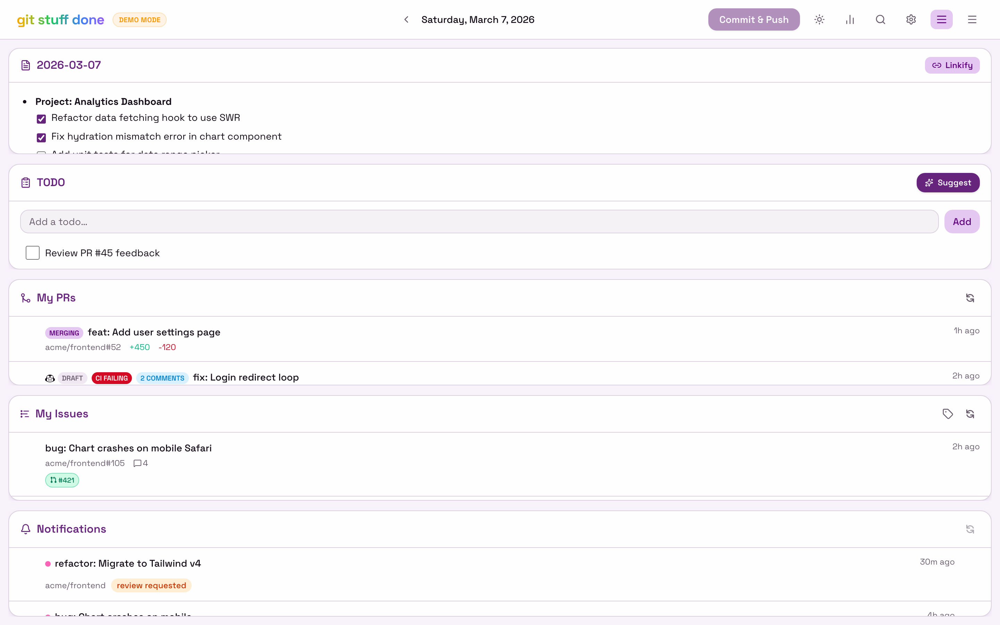
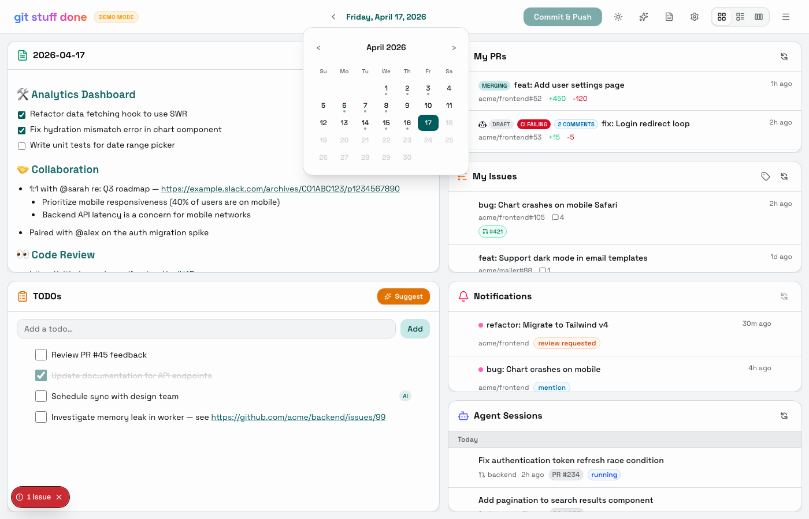

# ✨ git-stuff-done

**git-stuff-done** is your personal developer dashboard designed to keep you in the flow. It combines a distraction-free markdown editor for your daily work logs with AI superpowers. Track your work, manage your PRs and GitHub notifications, and generate work summaries all in one place.

## 👉 [check out the demo](https://therzka.github.io/git-stuff-done/) 👈

(or see [screenshots](#screenshots) below)

## Features

- **📝 Work Log Editor** — A rich hybrid editor. Type markdown naturally — headings, bold, lists, and links render inline as you type.
- **📅 Date Navigation** — Browse past logs with a calendar picker. Dates that have content show a dot indicator. Use ← / → to step day by day, or click **Today** to jump back.
- **🪄 Linkify** — Click **🪄 Linkify** to resolve bare GitHub URLs to titled markdown links. Updates the log in-place.
- **✨ AI Assistant** — A unified modal (toolbar ✨ button) with two modes:
  - **📊 Summarize** — Generate AI-powered summaries of your work logs for daily standups or weekly reports. Choose the AI model, pick a date range, and **save summaries** directly to your repo in `summaries/`. Preset templates (Daily Standup, Weekly Report, Detailed Changelog, AI Usage) auto-fill the date range — weekly presets set the start date to 7 days ago.
  - **🔍 Search** — Natural language search across your work logs. Ask questions like "What did I work on last week?" or "Find all examples of pairing sessions." The search automatically classifies your query into one of three strategies:
    - **Exhaustive** — queries like "find all examples of X" or "every time I mentioned Y" search through ALL available logs to find every instance.
    - **Date-bounded** — queries with time constraints like "last two weeks" or "in February" search only the specified range.
    - **Recent-first** — general queries progressively look back in 7-day increments (up to 365 days), accumulating context so the AI has more to work with each iteration. GitHub context is cached across iterations to avoid redundant API calls. Ideal for "when did I last…" style questions with resumable deep lookback.
  - The search API streams results via NDJSON, so you see real-time progress in the UI — query classification, log loading, batch progress, and AI call status update live as the search runs. Query classification uses a fast model internally regardless of the user-selected model. A **Stop** button cancels any in-progress search. Follows GitHub links in your logs for additional context and never fabricates answers. Includes a model selector shared across both modes.
  - Results render as **rich text** (headings, bold, links, lists) but copy as **markdown** — select and copy from results or use the Copy button to get clean markdown.
- **🤖 Dynamic Model Loading** — Available AI models are loaded from the Copilot SDK at runtime and cached for 24 hours. Falls back to a built-in default list if the SDK is unavailable.
- **📋 Saved Summaries** — Browse, preview, copy, and delete past AI-generated summaries. Opens from the toolbar 📋 button. Summaries render as rich text with markdown-on-copy.
- **✅ TODO List** — Manual TODOs with inline editing + AI-suggested action items based on your work log.
- **@️ @Mentions** — Type `@` in the editor to search your GitHub org's members. A dropdown shows matching usernames with avatars; select one to insert a bold, linked mention (e.g. **[@username](https://github.com/username)**). Supports keyboard navigation (↑/↓/Enter/Esc).
- **🔀 My PRs** — Live feed of your open PRs (authored or assigned) in your GitHub org with status badges: **Copilot** (authored by Copilot, you're an assignee), **Draft**, **Queued** / **Merging** (merge queue), **CI Failing** (required checks only), **Needs Review** (awaiting human review), and **unanswered comment count** (excludes bots and resolved threads). Click the insert button on any PR to paste its link at the cursor in your work log.
- **🐛 My Issues** — Open issues assigned to you across your GitHub org, showing labels (toggleable) and comment counts. Linked PRs appear as chips styled by state (open/draft/merged/closed). Click the insert button to paste a link at the cursor in your work log.
- **🤖 Assign to Copilot** — From the My Issues panel, hover over any issue without a linked PR and click the Copilot icon to assign it to the GitHub Copilot coding agent. A modal lets you select the **target repository** (where the PR will be created — useful when issues live in a tracker repo but code lives elsewhere), the **AI model** for Copilot to use, and provide **additional instructions**. Issues already assigned to Copilot show a "Copilot" badge. Uses the GitHub REST API with the `agent_assignment` parameter for cross-repo PR creation.
- **🔔 Notifications** — Filtered GitHub notifications: reviews requested, mentions, assignments, and activity on your issues/PRs. Click the insert button to paste a link at the cursor. Dismiss individual notifications with the X button (reappear on reload).
- **🤖 Agent Sessions** — Browse recent Copilot CLI sessions pulled from `~/.copilot/session-store.db`. Sessions are grouped by date (**Today / Yesterday / This Week / Older**) and each entry shows the session summary, turn count, time elapsed, and any linked PR or commit badges. Hover any session to reveal an insert button that pastes a formatted markdown link into your Work Log. Hidden by default — enable it from the ☰ panel menu.
- **🚀 Auto-commit & Push** — Hourly auto-commit of your logs and TODOs to a git repo, with push to remote. The commit button provides inline visual feedback — it changes color and text to show success, "no changes", or error states for 3 seconds, then reverts. No layout shift.
- **⚙️ Settings** — Ignore noisy repos in notifications. Adjust **font size** across the dashboard (Compact / Default / Comfortable / Large) — only text scales, layout stays stable. Font size is saved to `data/config.json` for persistence; layout and panel visibility preferences are saved in localStorage.
- **▤ Layout modes** — Toggle between grid (2-column) and column (single-column) layouts. Hide individual panels and restore them from the ☰ menu. Preferences are saved in localStorage.
- **🌗 Dark Mode** — First-class support for both light and dark themes.

## Prerequisites

- **Node.js** 20+
- **GitHub Copilot CLI** (`copilot`) — installed and in your PATH. The SDK communicates with the CLI in server mode for AI features.
  - [Installation guide](https://docs.github.com/en/copilot/how-tos/set-up/install-copilot-cli)
  - Requires a GitHub Copilot subscription (free tier available)
- **A GitHub Personal Access Token (PAT)** with read-only scopes — see setup step 2 below.
- **GitHub CLI** (`gh`) — optional, only needed if you skip the PAT step. If present and authenticated, it's used as a fallback for GitHub API access.

## Setup

1. **Fork, then clone your fork:**

   Click **Fork** on GitHub to create your own copy of this repo, then clone it:

   ```bash
   git clone https://github.com/<your-username>/git-stuff-done git-stuff-done
   cd git-stuff-done
   npm install
   ```

   > ⚠️ Do not clone this repo directly — the auto-commit feature pushes to the git remote, and you won't have push access to the original repo.

2. **Create a GitHub PAT:**

   Go to https://github.com/settings/personal-access-tokens/new and create a fine-grained token with:
   - **Repository access:** Public repositories (or select specific repos if needed)
   - **Permissions:** `Issues` → Read & Write, `Pull requests` → Read & Write, `Notifications` → Read-only, `Actions` → Read & Write, `Contents` → Read & Write
   - Read-only access is sufficient for viewing PRs, issues, and notifications. **Write access** is required for the "Assign to Copilot" feature (assigning issues, creating comments, and triggering the Copilot coding agent).

   If your org requires SSO, click **Configure SSO** → **Authorize** for your org after creating the token.

3. **Configure environment:**

   ```bash
   cp .env.example .env.local
   ```

   Edit `.env.local`:
   - `GITHUB_READ_TOKEN` — the PAT from step 2
   - `GITHUB_ORG` — your GitHub org name (filters notifications, PRs, links)
   - `GIT_STUFF_DONE_DATA_DIR` — (recommended) path to a separate git repo for storing logs/TODOs

4. **Set up a separate repo for your logs (recommended):**

   Without `GIT_STUFF_DONE_DATA_DIR`, logs and TODOs are stored inside the app repo itself (your fork). To keep them separate:

   Create a new private repo on GitHub for your logs, then clone it:

   ```bash
   git clone https://github.com/<your-username>/my-work-logs ~/my-work-logs
   ```

   Set `GIT_STUFF_DONE_DATA_DIR=~/my-work-logs` in `.env.local`. The directory must be a git repo with a remote for auto-push to work.

5. **Run the dashboard:**
   ```bash
   npm run dev
   ```
   Open http://localhost:3000

## Environment Variables

| Variable                  | Default                           | Description                                                                                                                                   |
| ------------------------- | --------------------------------- | --------------------------------------------------------------------------------------------------------------------------------------------- |
| `GITHUB_ORG`              | _(none)_                          | GitHub org to filter notifications, PRs, and links                                                                                            |
| `GITHUB_READ_TOKEN`       | _(falls back to `gh auth token`)_ | GitHub token ([create one](https://github.com/settings/personal-access-tokens/new) with Issues, PRs, Notifications, Actions, Contents — write access needed for Copilot assignment) |
| `GIT_STUFF_DONE_DATA_DIR` | `./` (app dir)                    | Path to a git repo where `logs/` and `data/` will be stored                                                                                   |

## How It Works

- **Storage:** Daily logs are saved as `logs/YYYY-MM-DD.md`. Summaries are saved in `summaries/YYYY-MM-DD-{type}.md`. TODOs live in `data/todos.json`. Settings in `data/config.json`.
- **Linkify:** Click **🪄 Linkify** in the log panel. Strips GitHub URLs to their bare form first (removing sub-paths like `/files`, fragments, and query params), then resolves them to titled markdown links (e.g. `[Fix auth bug (#123)](url)`). Saves the result back to the same file.
- **Auto-commit:** Every hour while the app is running, changes to `logs/`, `summaries/`, and `data/` are committed and pushed. You can also trigger a manual commit via the 🚀 button.
- **Timezone:** All dates use America/Los_Angeles (Pacific Time). Edit `getTodayDate()` in `src/lib/files.ts` to change.

## Tech Stack

- Next.js 16 (App Router) + TypeScript
- Tailwind CSS v4
- Tiptap (ProseMirror) rich text editor
- `@github/copilot-sdk` for AI summaries and dynamic model discovery
- Space Grotesk + JetBrains Mono fonts
- Octokit for GitHub API
- react-resizable-panels for layout
- `better-sqlite3` for reading the Copilot CLI session store

## Screenshots

|                     Light Mode                      |                     Dark Mode                      |
| :-------------------------------------------------: | :------------------------------------------------: |
|  |  |

|                    TODO List                    |                 AI-Suggested TODOs                 |
| :---------------------------------------------: | :------------------------------------------------: |
|  |  |

|                AI Assistant — Summary             |                   AI Assistant — Result                  |
| :-----------------------------------------------: | :------------------------------------------------------: |
|  |  |

|             AI Assistant — Search            |                    Alternate Layout                     |
| :------------------------------------------: | :-----------------------------------------------------: |
|  |  |

|                  Calendar Picker                   |     |
| :------------------------------------------------: | :-: |
|  |     |
